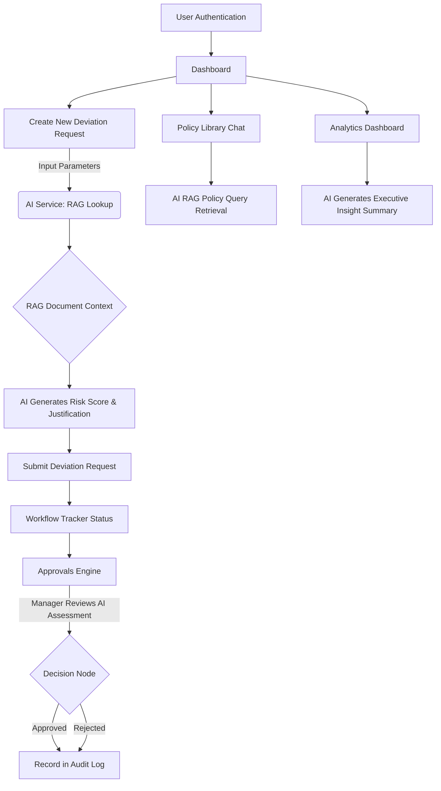

# Nexus Control Center (DeviQ)

Nexus Control Center (DeviQ) is a comprehensive, AI-assisted platform designed for telecom operators to manage, track, and analyze service deviation requests. The system employs intelligent Risk Analysis, automatic prompt justification based on company policies, and an insightful dashboard overlay to simplify regulatory compliance (like TRAI, MIB, PMLA) and streamline manager approvals.

## 📸 UI Previews

*(Add links to your actual screenshots here)*
* `[Placeholder] Dashboard Metrics.png`
* `[Placeholder] New Deviation Risk Score.png`
* `[Placeholder] Manager Approval View.png`
* `[Placeholder] Policy Library RAG Chat.png`

## 📂 Project Structure & Files Created

The repository architecture reflects a modular React codebase:

- **`src/pages/`** - Contains all the fully implemented functional views:
  - `LoginPage.tsx`: User authentication portal.
  - `DashboardPage.tsx`: High-level metrics view.
  - `NewRequestPage.tsx`: Form for filing a service deviation request.
  - `MyRequestsPage.tsx`: Listing of requests raised by the user.
  - `ApprovalsPage.tsx`: Managerial dashboard for taking action (Approve/Reject) on requests.
  - `WorkflowTrackerPage.tsx`: Real-time status tracker for requests.
  - `AuditLogPage.tsx`: Compliance log tracking all deviation-based actions.
  - `AnalyticsPage.tsx`: Detailed data charts mapping the resolution time and risk profiles.
  - `PolicyLibraryPage.tsx`: Interactive AI RAG chat system for interrogating company policy guidelines.
- **`src/services/`** - Integrations and remote API calls:
  - `llm.service.ts`: Integrates with the TCS GenAI Lab proxy. Handles dynamic fallback logic and prompt engineering for generating insight, scoring risks, and justifications.
  - `rag.service.ts`: Handles requests to the external Python FastAPI RAG backend, retrieving context for deviations directly from indexed Policy PDFs.
- **`src/contexts/`** - Global State Management (`AuthContext`, `DeviationContext`, `NotificationContext`, `ThemeContext`).
- **`src/components/`** - Collection of highly reusable `shadcn/ui` based elements. 

## 🛠️ Technology Used

This application uses a modern frontend tech stack, prioritizing performance, strict typing, and polished aesthetics:

- **Core Framework:** React 18, Vite, TypeScript
- **Styling Architecture:** Tailwind CSS, `shadcn/ui` (leveraging Radix UI primitives for accessibility)
- **Routing:** React Router v6
- **State Management & Data Fetching:** TanStack React Query v5, React Context API
- **Forms & Validation:** React Hook Form configured with Zod schema validation
- **Data Visualization & Animation:** Recharts, Framer Motion

## 🧠 AI Models Used

The AI functionalities in Nexus Control Center are channeled through the **TCS GenAI Lab (LiteLLM Proxy)** endpoint, allowing for multi-model orchestration and graceful failovers.

1. **OpenAI GPT-4o (`genailab-maas-gpt-4o`)**: 
   - Primary model for generating detailed, compliance-friendly **Business Justifications**.
   - Serves as the primary intelligence for the **Policy RAG Query**, retrieving explicit clauses from indexed Telecom documents.
2. **Google Gemini 2.5 Flash (`gemini-2.5-flash`)**:
   - Computes **AI Risk Scores** mapping deviation severity from 0-100 base factors (urgency, customer tier).
   - Rapidly reads structured metrics to produce **Executive Analytics Insights**.
3. **Retrieval-Augmented Generation (RAG) System**:
   - An independent FastAPI microservice (configured via `VITE_RAG_API_URL`) handles the indexing of PDF policies using FAISS and vector embeddings to inject up-to-date company policies into the LLM context limits.

## 🔄 Functionality Flows

1. **Risk Assessment:** As a requester fills out a deviation form, the AI fetches context from the RAG service, analyzes parameters, and assigns a Risk Level (Low/Medium/High/Critical).
2. **Justification Generation:** The AI creates a compliant business justification based on current policies, saving time for the human agent.
3. **Approval Escalation:** Approvers view requests, aided by AI-highlighted factors and exact policy document references.
4. **Policy Interrogation:** Users can use the Policy Library to ask specific questions "What is the penalty for SLA breach during Force Majeure?" and receive exact cited answers.

### 📐 Workflow Flowchart



## 📋 Prerequisites

Ensure you have the following installed before standing up the environment:
* **Node.js** (v18.x or via `bun`)
* **Python 3.10+** (Required only for the RAG backend server)

## ⚙️ Environment Variables

Copy the `.env.example` file to `.env` using your specific secrets:

| Variable | Description |
| :--- | :--- |
| `VITE_LLM_API_KEY` | Authentication key mapping to the TCS GenAI proxy. |
| `VITE_LLM_BASE_URL` | Route for your LLM completion requests (e.g., `https://genailab.tcs.in/lite/v1`). |
| `VITE_RAG_API_URL` | URI of the local Python FastAPI RAG Server (default: `http://localhost:8001`). |

## 🚀 Getting Started

### 1. Start the React Frontend

Install packages and initialize Vite's dev server:
```bash
npm install
npm run dev
```
Navigate to `http://localhost:8080` (or the port specified by Vite) to view the UI.

### 2. Start the RAG Document Backend (Python)

For AI context to populate policies accurately, the Python RAG backend must be running parallel to the Node server.
Navigate to the root Python backend directory (if externalized) or execute the bat file:
```bash
# If running through included scripts:
./RAG/start_rag.bat

# Manual Python Start (Assuming venv is setup):
python -m uvicorn main:app --reload --port 8001
```

## 🧪 Testing

This project incorporates `vitest` mapped onto React DOM test utilities.

```bash
# General test suite execution
npm run test

# Hot-reloading test watcher
npm run test:watch
```

## 🏆 Acknowledgements

Developed with ❤️ by **Team 11** at the **Chennai Siruseri Hackathon**.
